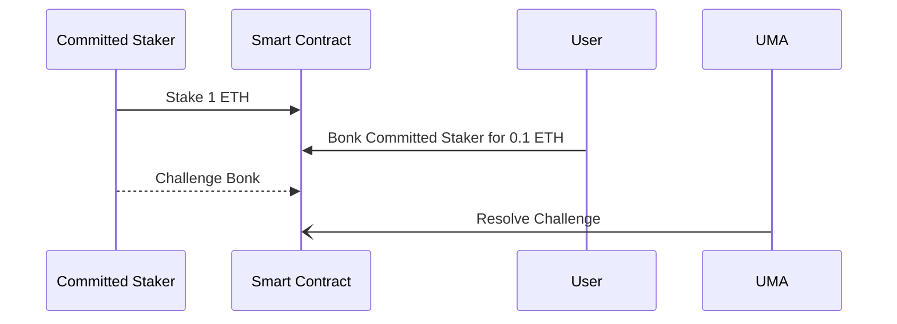

# Setting the scene: Commitment Devices and Cooperative Games

[Commitment devices](https://hackmd.io/@sxysun/ccdwtf#Day-1-Blockchain-Commitment-Devices) are ways to incentivize towards or disincentivize away from behavior. Incentivizing towards some behavior is well-studied (see airdrops, liquidity mining, KPI options), otherwise known as THE CARROT. We present a device that can be used to disincentivize someone from breaking their commitments, otherwise known as THE STICK, otherwise known as BONK go to commitment violation jail. We need both the CARROT and the STICK to play [cooperative games](https://medium.com/@virgilgr/ethereum-is-game-changing-technology-literally-d67e01a01cf8).

> A major value proposition of cryptoeconomic mechanisms is that users can trustlessly collaborate by making credible commitments of their actions.

> Crypto-economic systems such as the Ethereum blockchain are commitment devices on which humans and algorithmic agents play real-world coordination games at large scale and high frequency. Importantly, the outcomes of these coordination games depend crucially on the design of the commitment device.

# BONK

"Bonk", also known as "The Stick" or "UMA SLA", is a smart contract enabling users to stake and commit to agreements, enabling _anyone else_ to retroactive slash them due to misconduct as stipulated in the agreement terms. The agreement is enforced by the [UMA Optimistic oracle](https://docs.uma.xyz/developers/optimistic-oracle-v3/data-asserter). This mechanism is analogous to an on-chain SLA (Service Layer Agreement) for any agreement that is publicly verifiable.

This protocol is designed to be used by a service provider who wants to assert their reputation to their prospective users via economic stake. This gives users confidence that if their service provider defies the terms of their mutual agreement, then they can receive reparations. Essentially, this mechanism can be used by service providers to "put their money where their mouth is".

This project also has been referred to as "The Stick" because it acts as a disincentive to certain behaviors, as opposed to "The Carrot" which acts as an incentive. [UMA's "KPI Options"](https://docs.uma.xyz/resources/glossary#kpi-options) are an example of a Carrot-esque project that incentives certain behavior.

## Mechanism description
- A user who wants to create an SLA calls `makeCommitment` function, defining the `Commitment` information pertaining to what they are committing to. This contains:
   - the `stakeToken` - token to stake
   - the `stakeAmount` - amount to stake 
   - the `commitmentTermsIdentifier` which is used to define the terms of the commitment. This field can be arbitrarily complex, such as an IPFS hash with a fully fleshed out SLA document.
- As long as the staker does not break the terms of the SLA nothing happens to them.
- Once you've entered into an SLA you cant instantly withdraw from the position. You must wait at least `challengePeriod` time before you can access your funds.
- If they break the terms of their SLA they can get `bonk`ed by someone.
   - To call `bonk` the caller must pay the `bonkBond` to prevent malicious/spam bonks. This bond is returned at the conclusion of the bonking if it was done correctly.
   - When bonked any pending withdraws are canceled.
   - The caller of `bonk` must define which `slashRecipient` address should receive the `slashAmount`. This enables the bonking to be scaled depending on the side of the violation made against the SLA. The caller can also define an optional `details` field which is used to help verifiers verify the `bonk` claim.
   - There is `challengePeriod` time allocated for someone to `denyBonk`, which acts as a _dispute_ against the `bonk`. When this happens the `bonk` is escalated to the UMA DVM to resolve the dispute. Note that the UMA DVM is only responsible for dealing with correct allocation of the `bonkBond`s as a result of the dispute.
- After `challengePeriod` is passed, `finalizeBonk` can be called to settle the `bonk`ing and pay as defined in the `bonk` call.

### Smart Contract Sequence Diagram

This is the simplest sequence for how a Committed Staker would use Bonk and how their stake could be slashed. The relevant parties are:

- Committed Staker: The service provider who stakes 1 ETH to back their SLA
- User: Uses and pays for the Committed Staker service and slashes them if they defy their SLA. Their relationship and how payments happen are defined out of the Bonk system.
- UMA: Resolves Bonk disputes.

## Use cases
Bonk can be used in any situation where you need a financial commitment device to hold people accountable to what they claim they will uphold. Some initial examples we like include:

### MEV Relays

MEV Relays are critical infrastructure connecting block proposers (validators) and builders. In the current MEV landscape this is a trusted actor. It is currently an [active topic of research](https://github.com/flashbots/mev-boost/issues/142) of MEV relays more [accountable](https://github.com/flashbots/mev-boost/issues/99) through the introduction of [block scoring](https://collective.flashbots.net/t/block-scoring-for-mev-boost-relays/202) a relays behaviour. There are currently proposals on how to [monitor](https://hackmd.io/@ralexstokes/SynPJN_pq) this kind of behavior, as well as a path forward to [include this within MEV-boost](https://github.com/flashbots/mev-boost/issues/99) but as of present there is no known timeline for this to be added to the protocol.

Bonk could be used by Relays to add economic insurance to validators and builders who opt to use their service. For example, a relay could put 50 ETH within an SLA and commit to not deviating against some known and publicly verifiable block scoring metric. A Relay could commit publically to upholding some of the following bid validation metrics:
- Consensus Layer Faults are when a Bid does not follow Ethereum Consensus Layer Protocol (e.g.: timestamp, previous randao or parent hash do not follow previous block's values).
- Data Validation Faults are when a Bid does not follow Ethereum data types (e.g.: BLS12-381 Public keys should be 96 bytes long).
- Registration Faults are when either the gas limit or fee recipient do not match validator registrations.

Or, a relay could create their own definition within the SLA that they want to uphold. The point is that they can define an arbitrary set of rules that they promise to uphold and are penalized if they violate those rules.

### Social Network Behavior

Twitter accounts with more followers are more valuable. A Twitter user could promise certain KPI's and stake into Bonk to generate a viral following or commit to arbitrary terms. For example, [Hart](https://twitter.com/hal2001) the CEO of UMA has promised internally that he is committed to growing UMA's following so he could let us BONK him if he doesn't tweet at least 5 times a week.

## FAQ

### Who gets paid the slashed stake?

The slasher or "Bonker" can choose who gets paid.

### How much stake gets slashed?

The terms of the agreement should stipulate how much stake is liable to be slashed depending on the severity of the violation of the terms. So the Bonker is responsible for slashing the correct amount of stake.

### What if the slash attempt is invalid?

The Bonker, or anyone, can add an additional stake to challenge a Bonk attempt, and the challenge will be resolved by the UMA Oracle. The Oracle will use the terms of the agreement originally proposed by the staker to resolve the challenge. As in all UMA challenges, the winner of the challenge will be paid out from the loser's stake.

## Miscellaneous ideas

Here are some other ideas suggested by ChatGPT:

1. **Crypto Project Milestones**:
   - **Scenario**: A new crypto project promises to deliver certain features or milestones by specific dates. To gain trust from the community, the project team stakes a significant amount of their own tokens or funds.
   - **Public Verification**: If the milestones are not met by the promised dates, evidence can be presented on-chain, such as missed GitHub commits, lack of announced features, or failed audits.
   - **Outcome**: The staked funds are slashed and might be distributed back to the token holders or burned.
2. **Environmental Commitments**:
   - **Scenario**: Companies pledge to reduce their carbon footprint by a certain percentage within a given timeframe. They stake funds as a commitment to this goal.
   - **Public Verification**: Independent environmental agencies or auditors can verify the company’s progress through public reports, emissions data, or satellite imagery.
   - **Outcome**: Companies that fail to meet their targets lose their staked funds, which could then be donated to environmental causes.
3. **Public Infrastructure Projects**:
   - **Scenario**: A construction company wins a bid to build a public infrastructure project, such as a bridge or road, within a certain timeframe. They stake funds to ensure timely completion.
   - **Public Verification**: Progress can be verified through public records, site inspections, or even drone footage.
   - **Outcome**: Delays or non-compliance result in the company’s staked funds being slashed, which could be used to compensate the local community or fund other public projects.
4. **Supply Chain Integrity**:
   - **Scenario**: A brand commits to sourcing materials ethically, ensuring no child labor or environmentally harmful practices are involved. They stake funds to back this commitment.
   - **Public Verification**: Third-party audits, supply chain tracking systems, or whistleblowers can provide evidence of any breaches.
   - **Outcome**: Any violations lead to the brand’s staked funds being slashed and potentially given to NGOs working against child labor or environmental harm.
5. **Decentralized Finance (DeFi) Protocols**:
   - **Scenario**: A DeFi protocol promises to maintain a certain level of liquidity in its pools or to keep its stablecoin pegged to a specific value. The protocol stakes funds as a guarantee.
   - **Public Verification**: On-chain data can easily verify the liquidity levels or the stablecoin’s peg.
   - **Outcome**: If the protocol fails to maintain its promises, the staked funds are slashed, providing additional security and trust to its users.

### Future Work

- Add in the ability for the staker to earn revenue in exchange for staking. This is where KPI options could be integrated, but it would be nice if stakers had an option to charge fees for their service. However, its not clear who would pay these fees and how they would be enforced. The service type would have to be one that could be whitelisted only for subscribers.
- Ability for there to be multiple stakers for each agreement. This was avoided for complexity reasons because it would make the slashing math a bit more complicated. Moreover, it also goes hand in hand with the previous point: it is more likely that someone would stake on someone else's behalf if there were fees rewarded to stakers.
