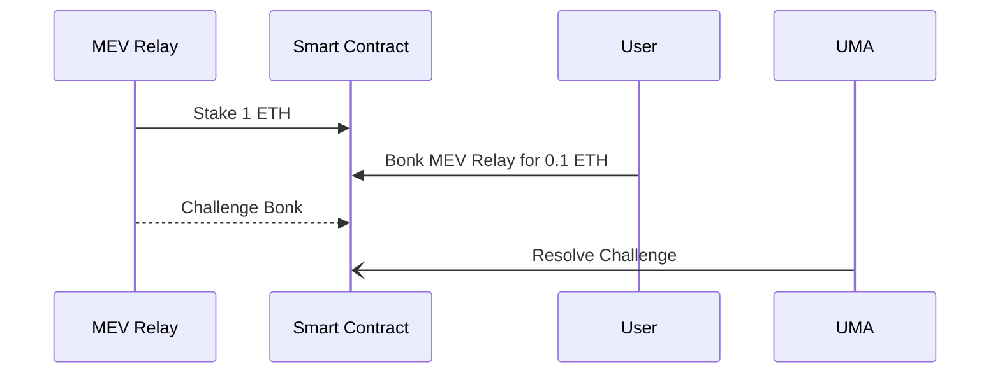

# BONK

"Bonk", also known as "The Stick" or "UMA SLA", is a smart contract enabling users to stake and commit to agreements, enabling *anyone else* to retroactive slash them due to misconduct as stipulated in the agreement terms. The agreement is enforced by the [UMA Optimistic oracle](https://docs.uma.xyz/developers/optimistic-oracle-v3/data-asserter). This mechanism is analogous to an on-chain SLA (Service Layer Agreement) for any agreement that is publicly verifiable.

This protocol is designed to be used by a service provider who wants to assert their reputation to their prospective users via economic stake. This gives users confidence that if their service provider defies the terms of their mutual agreement, then they can receive reparations. Essentially, this mechanism can be used by service providers to "put their money where their mouth is".

This project also has been referred to as "The Stick" because it acts as a disincentive to certain behaviors, as opposed to "The Carrot" which acts as an incentive. [UMA's "KPI Options"](https://docs.uma.xyz/resources/glossary#kpi-options) are an example of a Carrot-esque project that incentives certain behavior. 

## Use cases

### MEV Relays

MEV Relays are critical infrastructure connecting validators and builders but they are trusted. There are numerous [examples](https://github.com/flashbots/mev-boost/issues/142) of MEV relays [misbehaving](https://notes.ethereum.org/@yoav/BJeOQ8rI5#Aligning-incentives-to-prevent-missed-slots) and many [calls](https://collective.flashbots.net/t/block-scoring-for-mev-boost-relays/202) to make [relays](https://hackmd.io/@ralexstokes/SynPJN_pq) [more](https://hackmd.io/bTmbknkGRM6RdVCCIrRblg) [accountable](https://github.com/flashbots/mev-boost/issues/99).

Bonk could be used by Relay providers to add more insurance to validators and builders who opt to use their service.

### Social Network Behavior

Twitter accounts with more followers are more valuable. A Twitter user could promise certain KPI's and stake into Bonk to generate a viral following or commit to arbitrary terms. For example, [Hart](https://twitter.com/hal2001) the CEO of UMA has promised internally that he is committed to growing UMA's following so he could let us BONK him if he doesn't tweet at least 5 times a week.

## Smart Contract Sequence Diagram

This is the simplest sequence for how an MEV Relay would use Bonk and how their stake could be slashed. The relevant providers are:
- MEV Relay: The service provider who stakes 1 ETH to back their SLA
- User: Uses and pays for the MEV Relay service and slashes them if they defy their SLA
- UMA: Resolves Bonks

## FAQ

### Who gets paid the slashed stake?

The slasher or "Bonker" can choose who gets paid.

### How much stake gets slashed?

The terms of the agreement should stipulate how much stake is liable to be slashed depending on the severity of the violation of the terms. So the Bonker is responsible for slashing the correct amount of stake.

### What if the slash attempt is invalid?

The Bonker, or anyone, can add an additional stake to challenge a Bonk attempt, and the challenge will be resolved by the UMA Oracle. The Oracle will use the terms of the agreement originally proposed by the staker to resolve the challenge. As in all UMA challenges, the winner of the challenge will be paid out from the loser's stake.

## Miscellaneous ideas

Here are some other ideas suggested by ChatGPT:

1. **Crypto Project Milestones**:
   - **Scenario**: A new crypto project promises to deliver certain features or milestones by specific dates. To gain trust from the community, the project team stakes a significant amount of their own tokens or funds.
   - **Public Verification**: If the milestones are not met by the promised dates, evidence can be presented on-chain, such as missed GitHub commits, lack of announced features, or failed audits.
   - **Outcome**: The staked funds are slashed and might be distributed back to the token holders or burned.
2. **Environmental Commitments**:
   - **Scenario**: Companies pledge to reduce their carbon footprint by a certain percentage within a given timeframe. They stake funds as a commitment to this goal.
   - **Public Verification**: Independent environmental agencies or auditors can verify the company’s progress through public reports, emissions data, or satellite imagery.
   - **Outcome**: Companies that fail to meet their targets lose their staked funds, which could then be donated to environmental causes.
3. **Public Infrastructure Projects**:
   - **Scenario**: A construction company wins a bid to build a public infrastructure project, such as a bridge or road, within a certain timeframe. They stake funds to ensure timely completion.
   - **Public Verification**: Progress can be verified through public records, site inspections, or even drone footage.
   - **Outcome**: Delays or non-compliance result in the company’s staked funds being slashed, which could be used to compensate the local community or fund other public projects.
4. **Supply Chain Integrity**:
   - **Scenario**: A brand commits to sourcing materials ethically, ensuring no child labor or environmentally harmful practices are involved. They stake funds to back this commitment.
   - **Public Verification**: Third-party audits, supply chain tracking systems, or whistleblowers can provide evidence of any breaches.
   - **Outcome**: Any violations lead to the brand’s staked funds being slashed and potentially given to NGOs working against child labor or environmental harm.
5. **Decentralized Finance (DeFi) Protocols**:
   - **Scenario**: A DeFi protocol promises to maintain a certain level of liquidity in its pools or to keep its stablecoin pegged to a specific value. The protocol stakes funds as a guarantee.
   - **Public Verification**: On-chain data can easily verify the liquidity levels or the stablecoin’s peg.
   - **Outcome**: If the protocol fails to maintain its promises, the staked funds are slashed, providing additional security and trust to its users.

### Future Work

- Add in the ability for the staker to earn revenue in exchange for staking. This is where KPI options could be integrated, but it would be nice if stakers had an option to charge fees for their service. However, its not clear who would pay these fees and how they would be enforced. The service type would have to be one that could be whitelisted only for subscribers.
- Ability for there to be multiple stakers for each agreement. This was avoided for complexity reasons because it would make the slashing math a bit more complicated. Moreover, it also goes hand in hand with the previous point: it is more likely that someone would stake on someone else's behalf if there were fees rewarded to stakers.
